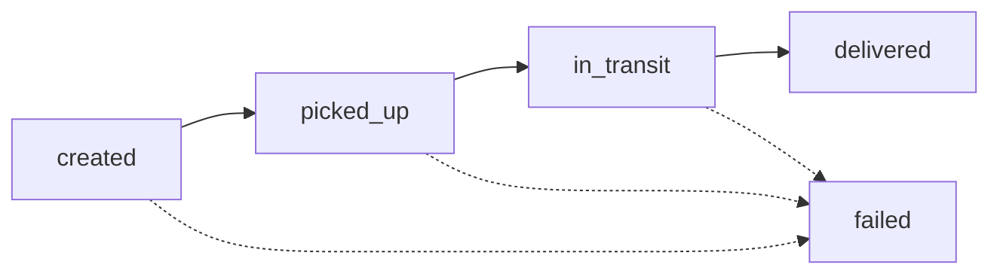

# Delivery Status Tracker

A vertical slice of a delivery-tracking product: PostgreSQL + FastAPI + React, with shipment
statuses governed by a **configuration-driven state machine** and every list endpoint paginated
server-side.

---

## Run the demo

**Prerequisites:** Docker Desktop (or any Docker Engine with Compose v2). Nothing else — no local
Python, Node or Postgres.

```bash
docker compose up --build
```

That is the whole setup. It starts PostgreSQL, runs the migrations, projects the lifecycle config
into the database, imports `shipments.csv`, and serves the UI:

| What | Where |
| --- | --- |
| Web UI | http://localhost:5173 |
| API docs (Swagger) | http://localhost:8000/docs |
| API | http://localhost:8000/api/v1 |

A healthy cold start takes about 15 seconds and says so:

```
bootstrap             | Database reachable after 1 attempt(s).
alembic.runtime...    | Running upgrade  -> 0001, Initial delivery-tracking schema.
bootstrap             | Migrations at head.
app.db.lifecycle_sync | Lifecycle 'shipment' v1 synced: 5 states, 6 transitions
app.db.seed           | Seed complete: 20 inserted, 0 already present (20 rows in shipments.csv)
bootstrap             | Ready: 20 shipments in the database.
```

Every step is idempotent, so restarting re-checks the migrations and the CSV without duplicating or
resetting anything (`0 inserted, 20 already present`).

A `Makefile` wraps the same commands with health-check waiting, which is nicer for a live demo:

```bash
make up      # build + start + wait until everything is healthy, then print the URLs
make test    # 68 backend tests (unit + API) against a throwaway database
make logs    # tail the API logs
make reset   # wipe the volume and rebuild from the CSV
make down    # stop and remove the volume
make help    # everything else
```

### Things worth clicking in the demo

1. **Filter and paginate.** Click a status chip; the counts come from the server, the page resets,
   and only one page of rows is ever fetched.
2. **Make a legal move.** "Update status" on a `created` shipment offers only *Mark picked up* and
   *Mark failed* — the server told the UI which moves are legal. The row updates without a reload.
3. **Try an illegal one.** `curl` a `created → delivered` jump and you get a 409 explaining what
   *would* have worked (see below). The UI cannot even offer it.
4. **Fail a shipment.** A reason is required — that is a guard declared in the config, enforced in
   the API, and reflected in the UI as a dialog.
5. **Open the history.** Click a reference for the paginated audit trail behind every change.
6. **Change the state graph.** Edit `backend/config/shipment_lifecycle.yaml`, run
   `make restart`, and the new states appear in the API, the database transition table and the UI
   — with no code change anywhere. (Verified; see [Extending the state graph](#extending-the-state-graph).)

---

## The state machine

The brief's lifecycle is `created → picked_up → in_transit → delivered`, with `failed` reachable
from any non-delivered status. Rather than encoding that in `if` statements, the graph lives in
**one YAML file** and everything else reads from it:

```yaml
# backend/config/shipment_lifecycle.yaml (excerpt)
states:
  - code: created
    label: Created
    initial: true
  - code: delivered
    label: Delivered
    terminal: true

transitions:
  - event: pick_up
    label: Mark picked up
    from: created
    to: picked_up

  # "failed from any non-delivered status", as a rule rather than six edges.
  - event: fail
    from: "*"
    except: [delivered, failed]
    to: failed
    guards: [require_reason]
```



### How the config reaches every layer

| Consumer | What it does with the config |
| --- | --- |
| `app/domain/state_machine.py` | Generic engine: parses the table, answers `can()` / `validate()`. Knows nothing about shipments. |
| `app/db/lifecycle_sync.py` | Projects states and edges into `shipment_status` / `shipment_status_transition` on every boot, so the database enforces referential integrity on statuses. |
| `GET /api/v1/lifecycle` | Serves the graph to the browser. |
| React UI | Renders status chips, filter list, colours and per-row action menus from that response. |

The engine is deliberately generic — states, edges, wildcards and guards in, validation out. The
shipment-specific knowledge is entirely in the YAML. Two design points worth calling out:

- **Wildcards with exclusions.** `from: "*"` + `except:` expresses "failed from anything that isn't
  finished" as a rule, so it keeps holding when a new state is added. Add `on_hold` and it becomes
  failable automatically.
- **Named guards.** A transition can require conditions (`guards: [require_reason]`) that are
  resolved against a registry in `app/domain/guards.py`. Config stays declarative; the condition
  stays testable Python. An unknown guard name is a startup error, not a runtime surprise.

### Rejecting an illegal transition

```bash
curl -X POST localhost:8000/api/v1/shipments/$ID/status \
     -H 'Content-Type: application/json' -d '{"status":"delivered"}'
```

```json
{
  "error": {
    "code": "invalid_transition",
    "message": "Cannot move shipment from 'created' to 'delivered'. Allowed next statuses: picked_up, failed.",
    "details": {
      "source": "created",
      "target": "delivered",
      "allowed_targets": ["picked_up", "failed"],
      "terminal": false
    }
  }
}
```

The error distinguishes four failure modes rather than lumping them into one 400:

| Situation | Status | Code |
| --- | --- | --- |
| Edge is not in the graph | 409 | `invalid_transition` |
| Status does not exist at all | 422 | `unknown_state` |
| Edge exists but a guard refused (e.g. no reason) | 422 | `transition_guard_rejected` |
| Someone else moved the shipment first | 409 | `concurrent_update` |

### Extending the state graph

To prove the claim, I added an `on_hold` state to the YAML and restarted — nothing else:

```
states:      created, picked_up, in_transit, on_hold, delivered, failed
transitions: 9 (was 6) — including on_hold → failed, picked up from the wildcard rule
UI actions on an in_transit shipment: Put on hold · Mark delivered · Mark failed
```

Removing it again dropped the row cleanly, because the sync refuses to delete a status that any
shipment still references.

---

## API

Base path `/api/v1`. Full schema at `/docs`.

| Method | Path | Notes |
| --- | --- | --- |
| `GET` | `/shipments` | **Paginated.** `page`, `page_size`, `status` (repeatable), `search`, `sort_by`, `sort_dir` |
| `GET` | `/shipments/summary` | Counts per status across the whole collection |
| `GET` | `/shipments/{id}` | One shipment with its legal next steps |
| `GET` | `/shipments/{id}/events` | **Paginated** status history, newest first |
| `POST` | `/shipments/{id}/status` | Move a shipment; body `{status, reason?, actor?, expected_version?}` |
| `GET` | `/lifecycle` | The state graph |
| `GET` | `/health`, `/ready` | Liveness / readiness (compose waits on `/ready`) |

**Pagination is not optional.** `PageParams` is a required dependency of every collection route and
the repository has no "fetch everything" method to reach for — the only way to read shipments is
`list_page(filters, params)`, which always applies `LIMIT`/`OFFSET`. `page_size` is capped
server-side (default 20, max 100), so an oversized request is rejected rather than honoured. Every
list responds with the same envelope:

```json
{ "items": [...],
  "meta": { "page": 1, "page_size": 20, "total_items": 20,
            "total_pages": 1, "has_previous": false, "has_next": false } }
```

Each row carries its own `allowed_transitions`, so the client never reimplements the rules and the
action menu can never offer an illegal move. The server still validates — the client-side list is
convenience, not the rule.

---

## Data model

```
shipment_status  ──┐   (states, projected from the YAML)
                   ├── shipment.status            FK → no free-text status can be written
                   └── shipment_event.{source,target}_status
shipment_status_transition   (the legal edges, in SQL, inspectable with psql)
shipment                     (id, reference UNIQUE, customer_name, status, version, timestamps)
shipment_event               (append-only history: source → target, event, reason, actor, occurred_at)
```

Decisions behind it:

- **Status as a FK to a lookup table, not a Postgres `ENUM`.** An enum needs a migration to change;
  a lookup table is re-synced from the config at boot. We still get database-level integrity, but
  the state graph stays editable in one file.
- **History as an append-only event log**, not a mutable "previous status" column. The status
  change and its event row are written in the same transaction, so a shipment can never sit in a
  status without the record that put it there — and the history view is just a read of those rows.
- **Optimistic locking via `version`.** A client may send `expected_version`; a mismatch is a 409
  instead of a silent overwrite. The write also re-checks the version in the `UPDATE ... WHERE`
  clause, and the read takes `SELECT ... FOR UPDATE`, so two concurrent transitions serialise.
- **Indexes for the actual queries**: `(status, reference)` for filter-then-sort,
  `(shipment_id, occurred_at, id)` for history. The last event per row is fetched with one
  `DISTINCT ON` query for the whole page rather than one query per row.

---

## Project layout

```
backend/
  app/
    api/          routes, dependencies, the single error-envelope translator
    core/         settings, logging, pagination primitives
    db/           models, session, lifecycle projection, CSV seeder
    domain/       the state machine, guards, domain errors   ← no framework imports
    repositories/ SQL only, no business rules
    services/     use cases: where the state machine meets persistence
    schemas/      Pydantic request/response models
  config/shipment_lifecycle.yaml    ← the state graph
  migrations/     Alembic
  scripts/bootstrap.py              wait → migrate → sync lifecycle → seed
  tests/
frontend/src/
  api/ hooks/ components/ pages/ lib/ types/
infra/postgres/init/                creates the test database
```

The dependency direction is one-way: `api → services → repositories → db`, with `domain` at the
bottom depending on nothing. That is what lets the state machine be unit-tested without a database
and reused unchanged if these rules ever move to another service.

---

## Tests

```bash
make test        # 68 tests: state machine + API
make test-unit   # state machine only, no database needed
```

Two layers, both meaningful:

**`tests/test_state_machine.py` (unit, no I/O).** The centrepiece is a parametrised sweep of the
**entire 5×5 transition matrix** against the lifecycle the app actually loads — all 25 pairs, so the
tests fail if the config is edited into something that no longer matches the brief. Plus terminal
states, guard rejection, unknown vs. illegal statuses, and a set of deliberately broken configs
(duplicate states, two initial states, unknown guard, edge to a nonexistent state) that must fail at
load time rather than at runtime.

**`tests/test_api_shipments.py` (integration, real PostgreSQL).** Pagination metadata and
non-overlapping pages, the server-side page-size cap, multi-value status filters, search, a valid
transition writing both the status and its history row, an illegal transition returning 409 *and
leaving the database untouched*, the reason guard, stale-version rejection, and paginated history
ordering.

I used a real PostgreSQL rather than SQLite: `SELECT ... FOR UPDATE`, `DISTINCT ON`, `ILIKE` and the
status foreign keys are exactly the behaviour under test, and a substitute engine would test
something I am not shipping. `make test` points the suite at a separate `tracker_test` database so
the demo data survives.

---

## Key decisions

| Choice | Why |
| --- | --- |
| **Docker Compose for everything** | The brief says the demo is the deliverable. One command, no local toolchain, health checks so the UI is only up once the data is loaded. |
| **Async SQLAlchemy 2.0 + asyncpg** | Typed ORM models feed both the app and Alembic autogenerate; async matches FastAPI's model. |
| **Alembic, not `create_all()`** | A schema you can evolve. `create_all()` is fine on day one and a dead end on day two. |
| **Seeding in the app, not `COPY`** | The CSV is validated against the state machine on import, so a bad status is a loud startup failure rather than a bad row. Idempotent upsert on `reference`, so restarts never duplicate or reset data. |
| **Repository / service split** | SQL in one place, rules in another. It is also what makes the service testable and the routes three lines long. |
| **TanStack Query** | Server-state caching, `keepPreviousData` for flicker-free pagination, and invalidate-on-success — which is why the table updates without a reload. |
| **Refetch after mutation, not optimistic patch** | The server owns which transitions are legal *next* and what the counts are. A local patch would guess at both. The mutation response is authoritative and the page is small. |
| **Tailwind v4** | Fast to build a consistent UI without shipping a component library for one screen. |
| **nginx proxying `/api`** | Same-origin in production means no CORS in the browser and no environment-specific API URL in the frontend. |
| **No auth / deployment** | Explicitly out of scope in the brief. |

### Deliberate trade-offs

- **Offset pagination, not keyset.** Simpler, and it gives the UI `total_pages`, which the design
  uses. At 20 rows it is free; at a million rows deep pages would need keyset — the repository is
  the only place that would change.
- **Dev dependencies live in the API image.** It keeps `make test` to one command with no second
  image. A production build would use a multi-stage Dockerfile that drops them.
- **The lifecycle is cached per process.** Changing the config needs a restart, not a hot reload.
  That is the right default for a rules table; the config is also a deploy artifact.

---

## What I'd do next

1. **Frontend tests.** The backend is well covered; the UI is not. I would add Vitest + Testing
   Library for the transition menu (only legal options render), the reason dialog, and the error
   path, with MSW faking the API.
2. **Concurrency test.** The optimistic lock is covered for a stale version, but not for two truly
   simultaneous writers. I would add a test firing two transitions concurrently and asserting
   exactly one wins.
3. **Keyset pagination** on `/shipments` as an opt-in `cursor` parameter, keeping offset for the
   page-number UI.
4. **URL-synced filters.** Filter, page and sort state currently live in React state, so a filtered
   view is not linkable or reloadable. Pushing it to the query string is small and makes the demo
   shareable.
5. **Bulk transitions.** Select several shipments and move them together, with a per-row result
   report — the state machine and the service already support it, only a batch endpoint is missing.
6. **Richer guards.** The registry is built for this: e.g. `require_role`, or "cannot deliver before
   pickup was scanned". Each is a function plus a line of YAML.
7. **Observability.** Structured JSON logs with a request id, and a counter per transition event —
   "how many failed today, and why" is the first question this product gets asked.
8. **CI.** GitHub Actions running `make test`, `ruff check` and `tsc -b` on every push. The commands
   are already single-line, so it is mostly boilerplate.

---

## AI usage note

**Tools:** Cursor (Composer, Claude) for the bulk of the code; targeted prompts rather than one
"build me an app" request.

**What was AI-generated:** most of the mechanical volume — Pydantic schemas, the Alembic migration
body, the React components' Tailwind markup, docstrings, and the first draft of the test bodies once
I had specified what each should assert.

**What was hand-written or hand-directed:** the decisions. Specifically the layering
(`domain` depending on nothing, repository/service split), the choice to make the state machine a
generic engine over an external transition table with wildcard expansion and a guard registry, the
decision to project the config into database lookup tables rather than use a Postgres enum, the
append-only event log as the source of history, optimistic locking with `version`, and the shape of
the error envelope. I also specified the test matrix — sweeping all 25 status pairs was a
requirement I set, not something the model proposed; its first draft tested three or four happy
transitions.

**What the AI got wrong:**

1. **A functional index that could not work.** The generated `Shipment.__table_args__` contained
   `Index("ix_shipment_reference_lower", func.lower(reference := "reference"))` — a walrus operator
   smuggled into an index definition, where `func.lower("reference")` would index the *string
   literal* `'reference'`, not the column. It looked plausible and would have shipped a useless
   index. I caught it while reviewing the model before running anything: inside a declarative class
   body the column isn't in scope for `__table_args__`, so the expression cannot be what it claims
   to be. I removed it — the search is `ILIKE '%term%'`, which no `lower()` btree index would serve
   anyway, and replaced it with a `(status, reference)` composite that matches the actual query.

2. **An N+1 dressed up as a window function.** The first version of `latest_events_for` built a
   `row_number()` subquery and then aliased the events table again for no reason, in code that did
   not actually run. Rewritten as a single `DISTINCT ON`, which the existing index serves directly.

3. **Event-loop scoping in the async test fixtures.** All 14 API tests failed with
   `attached to a different loop` — pytest-asyncio was giving each test its own loop while the
   engine was session-scoped, and asyncpg connections are bound to the loop that created them. The
   generated config set `asyncio_default_fixture_loop_scope` but not
   `asyncio_default_test_loop_scope`. The failure mode was obvious from the traceback; the fix was
   one line, once I stopped trusting the generated config and read what each option actually scopes.

The general pattern: AI was fast and reliable on things with an obvious shape (schemas, migrations,
JSX) and unreliable exactly where a plausible-looking expression hides a wrong one. Everything here
was reviewed and run — the transition matrix, the config-only extensibility claim, and each error
response in this README were all executed against the running stack, not assumed.
